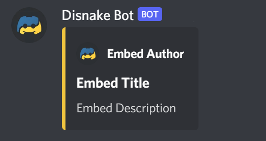
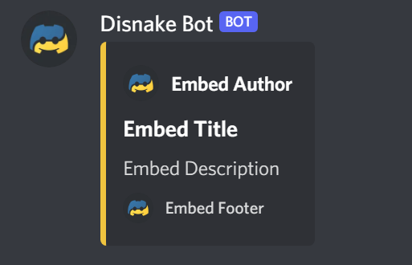
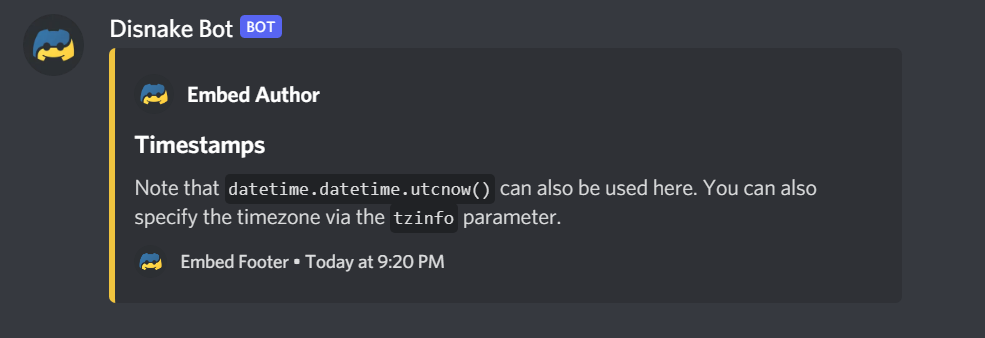
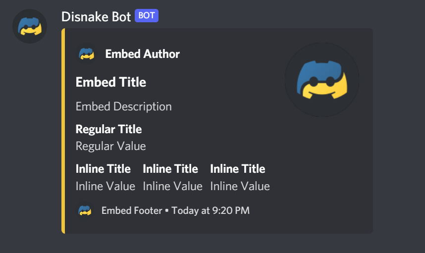
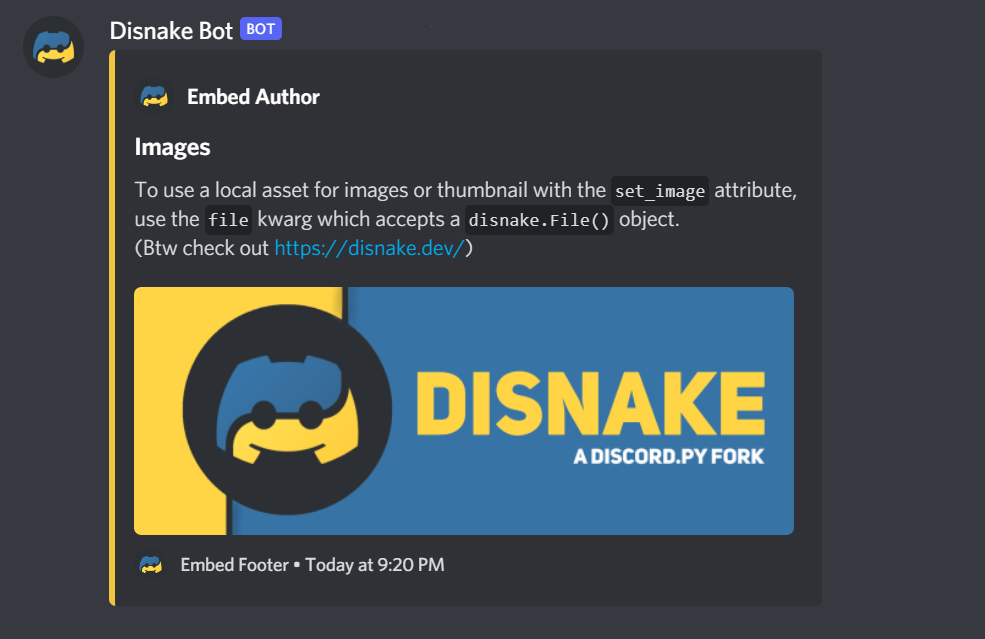

# Embeds

You might have seen some special messages on Discord (often sent by bots/webhooks), that have a colored border, embedded images, text fields and other properties. These elements are referred to as **Embeds**, and this section will cover how you can create and send one with your bot. This is done with the [`disnake.Embed()`]({{ disnakedocs }}/api.html?highlight=embed#embed)

This section will extensively cover the attributes and methods used with embeds. Thus, we recomment

## Embed preview

Here is an example of how an embed may look. We will go over embed construction in the next part of this article.

{ width="70%" }

The code for this embed is given below.

``` python linenums="1" title="embed.py"
# At the top of the file.
import disnake
from disnake.ext import commands

# Inside a command, event listener, etc.
embed = disnake.Embed(
    title="Embed Title",
    description="Embed Description",
    color=disnake.Colour.yellow(),
    timestamp=datetime.datetime.now(),
)

embed.set_author(
    name="Embed Author",
    url="https://disnake.dev/",
    icon_url="https://disnake.dev/assets/disnake-logo.png",
)
embed.set_footer(
    text="Embed Footer",
    icon_url="https://disnake.dev/assets/disnake-logo.png",
)

embed.set_thumbnail(url="https://disnake.dev/assets/disnake-logo.png")
embed.set_image(url="https://disnake.dev/assets/disnake-thin-banner.png")

embed.add_field(name="Regular Title", value="Regular Value", inline=False)
embed.add_field(name="Inline Title", value="Inline Value", inline=True)
embed.add_field(name="Inline Title", value="Inline Value", inline=True)
embed.add_field(name="Inline Title", value="Inline Value", inline=True)

await ctx.send(embed=embed)
```

!!! Note

    It is not strictly necessary to use all elements showcased above. You're free to leave some out as per your requirements.

The colour of the embed (via the `colour` parameter) accepts a [`disnake.Colour`]({{ disnakedocs }}/api.html?highlight=embed#disnake.Colour) instance, a HEX string or an integer.

To add a blank field to the embed, you can use `embed.add_field(name='\u200b', value='\u200b')`.

## Creating an embed

You can use the [`Embed`]({{ disnakedocs }}/api.html?highlight=embed#embed) instance for the creation and manipulation of embeds.

```python linenums="1" title="embed.py"
embed = disnake.Embed(
    title="An Embed!",
    description="A description!",
    colour=0xF0C43F,
)
```

{ width="33%" }

### Setting the author

You can set the author of the embed with the [`set_author`]({{ disnakedocs }}/api.html?highlight=embed#disnake.Embed.set_footer) attribute. Note that this code will come after you have defined `embed` via `embed = disnake.Embed(...)`.

```python linenums="1" title="embed.py"
embed.set_author(
    name="Embed Author",
    url="https://disnake.dev/",
    icon_url="https://disnake.dev/assets/disnake-logo.png",
)
```

{ width="34%" }

Since we have set a URL in this case, clicking on "Embed Author" will redirect the user to the [`disnake.dev`](https://disnake.dev/) website.

### Setting the footer

You can set the footer of the embed with the [`set_footer`]({{ disnakedocs }}/api.html?highlight=embed#disnake.Embed.set_footer) attribute. Note that this code will come after you have defined `embed` via `embed = disnake.Embed(...)`.

```python linenums="1" title="embed.py"
embed.set_footer(
    text="Embed Footer",
    icon_url="https://disnake.dev/assets/disnake-logo.png",
)
```

{ width="33%" }

### Setting the thumbnail

The thumbnail of the embed is shown in it's top right corner. It can be set using the [`set_thumbnail`]({{ disnakedocs }}/api.html?highlight=embed#disnake.Embed.set_thumbnail) attribute.

```python linenums="1" title="embed.py"
embed.set_thumbnail(url="https://disnake.dev/assets/disnake-thin-banner.png")
```

{ width="74%" }

### Using timestamps

Timestamps are shown in the footer of the embed, indicating the time at which the embed was sent/initiated. This can be done using the [`timestamp`]({{ disnakedocs }}/api.html?highlight=embed#disnake.Embed.timestamp) parameter of `disnake.Embed()`. Note that you will need to install and import the [`datetime`][datetime-pypi] package into your script.

```python linenums="1" title="embed.py" hl_lines="9"
# At the top of your script
import datetime

# Inside a command, event listener, etc.
embed = disnake.Embed(
    title="An Embed!",
    description="A description!",
    colour=0xF0C43F,
    timestamp=datetime.datetime.now(),
)
```

{ width="74%" }

### Inserting fields

Embed fields have two parameters - a name(or title) and a value, inside the [`add_field`]({{ disnakedocs }}/api.html?highlight=embed#disnake.Embed.add_field) attribute. It is also possible to use markdown in both parameters.

```python linenums="1" title="embed.py"
# Regular Fields
embed.add_field(name="Regular Title", value="Regular Value", inline=False)

# Inline Fields
embed.add_field(name="Inline Title", value="Inline Value", inline=True)
embed.add_field(name="Inline Title", value="Inline Value", inline=True)
embed.add_field(name="Inline Title", value="Inline Value", inline=True)
```

{ width="55%" }

These attributes also fully support the use of markdown, as well as highlight links. You can also insert fields at a particular position, with a specified index using [`embed.insert_field_at(index, ...)`]({{ disnakedocs }}/api.html?highlight=embed#disnake.Embed.insert_field_at).

### Inserting images

This can be done using the [`set_image`]({{ disnakedocs }}/api.html?highlight=embed#disnake.Embed.set_image) attribute, which accepts either a URL or a [`disnake.File()`]({{ disnakedocs }}/api.html?highlight=embed#file) object.

```python linenums="1" title="embed.py"
# Using a URL
embed.set_image(url="https://disnake.dev/assets/disnake-thin-banner.png")

# Using a local file
embed.set_image(file=disnake.File("path/to/file.png"))
```

{ width="72%" }

## Sending an embed

Once the embed is created, you need to send it to a channel too. This means you need to call `send(embed=embed)` on a messageable object, for example a `TextChannel` object (i.e. `message.channel.send`) or a `Context` object (`ctx.send`). Otherwise, the embed will not be sent.


[datetime-pypi]: https://pypi.org/project/DateTime/